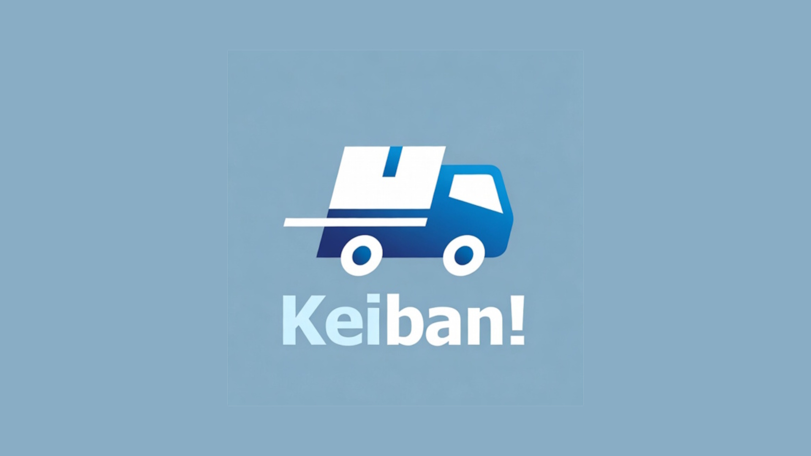
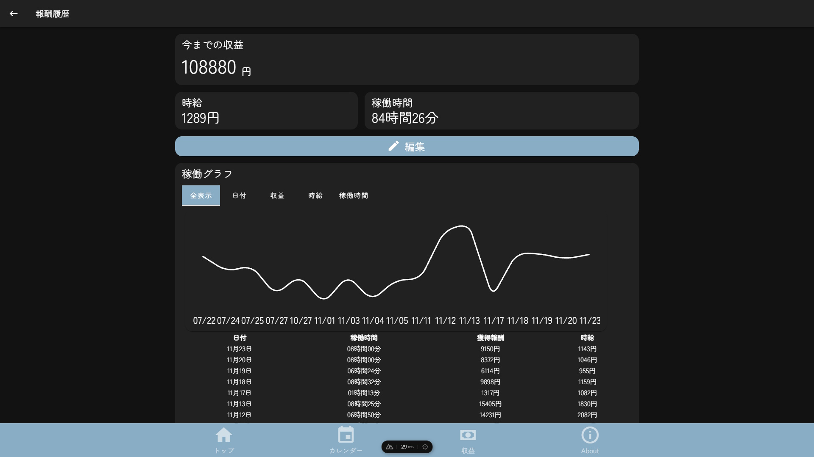

# ケイバン！

個人事業主向けの稼働管理・分析ユーティリティアプリ

🌐 **公開URL**: https://keiban.enoki.xyz




## Our Mission

個人事業主（フリーランス配達員など）の稼働管理をサポートし、時給計算・実績分析・燃費記録などの機能を提供する

## 機能

- 稼働履歴の登録・管理
- 日付別に経費・メモを記録
- 時給の自動計算
- グラフ・カレンダーで実績を確認
- 週・月・年・曜日ごとの統計表示
- 走行距離からざっくり燃費の計算
- 他ユーザーとのランキング比較
- プッシュ通知対応

## 動作環境

- PWA（Progressive Web App）としてブラウザからインストール可能
- Android 向け APK / AAB ファイルを同梱（Capacitor ビルド）
- iOS は PWA としての利用を想定

## 技術スタック

| カテゴリ       | 使用技術                                    |
| -------------- | ------------------------------------------- |
| フロントエンド | Nuxt 4 / Vue 3 / Vuetify 3                  |
| 状態管理       | Pinia（localStorage 永続化）                |
| テンプレート   | Pug + SASS                                  |
| 多言語対応     | vue-i18n（日本語・英語）                    |
| モバイル       | Capacitor（Android）                        |
| バックエンド   | PHP + Composer                              |
| データベース   | MySQL                                       |
| デプロイ先     | Vercel（フロントエンド）＋ PHP レンタルサーバー |

## ファイル構成

```
/
├── assets/               # SCSS スタイル・アイコン画像
├── components/
│   └── common/           # 共通コンポーネント（ヘッダー・フッター・バー等）
├── composables/          # Vue Composables（状態・テーマ・ユーザー・ロケール等）
├── items/                # ナビゲーション定義・ローディング部品
├── js/                   # ユーティリティ関数（Ajax・WebPush・メタ情報等）
├── layouts/              # アプリ共通レイアウト（default.vue）
├── locales/              # i18n ファイル（en.js / ja.js）
├── mixins/               # Vue Mixin
├── pages/                # ページコンポーネント
│   ├── index.vue         # トップページ
│   ├── calendar.vue      # カレンダー
│   ├── edit.vue          # 稼働履歴の編集
│   ├── fuel.vue          # 燃費計算
│   ├── history.vue       # 稼働履歴一覧
│   ├── analytics.vue     # 分析・グラフ
│   ├── settings.vue      # 設定
│   ├── about.vue         # このアプリについて
│   ├── login.vue         # ログイン
│   ├── registar.vue      # 新規登録
│   ├── rule.vue          # 利用規約
│   └── [userId].vue      # ユーザープロフィール
├── php/                  # PHP API サーバー
├── public/               # 静的ファイル（favicon・manifest.json 等）
├── nuxt.config.ts        # Nuxt 設定
├── capacitor.config.json # Capacitor（Android）設定
├── package.json          # npm 依存関係
├── database.sql          # MySQL スキーマ
└── database_VIEW.sql     # MySQL ビュー定義
```

## セットアップ

このアプリはフロントエンドサーバーと PHP バックエンドサーバーの 2 つが必要です。

### 前提条件

- Node.js + yarn
- PHP + Composer
- MySQL

### 1. リポジトリのクローン・依存関係のインストール

```shell
git clone git@github.com:jikantoki/keiban.git
cd keiban
yarn install
composer install  # PHP 用
```

### 2. 環境変数の設定

ルートに `.env` ファイルを作成し、以下のように記述（Vercel の場合は Project Settings → Environment Variables で設定）

```env
VUE_APP_WEBPUSH_PUBLICKEY=パブリックキー
VUE_APP_WEBPUSH_PRIVATEKEY=プライベートキー

VUE_APP_API_ID=default
VUE_APP_API_TOKEN=PHPで発行するアクセストークン
VUE_APP_API_ACCESSKEY=PHPで発行するアクセスキー

VUE_APP_API_HOST=APIサーバーのホスト
```

WebPush 用の鍵はここで発行できます: https://web-push-codelab.glitch.me/

### 3. PHP サーバーの設定

PHP バックエンドが必要な処理（API・認証・通知など）はレンタルサーバー等に `php/` フォルダをデプロイします。

1. API 用ドメインをフロントエンドとは別に用意する
2. `php/` フォルダをドメインのルートに配置（`.htaccess` 等で設定）
3. リポジトリルート直下に `/env.php` を作成し、以下を記述する

```php
<?php
define('DIRECTORY_NAME', '/プロジェクトルートのディレクトリ名');

define('VUE_APP_WebPush_PublicKey', 'パブリックキー');
define('VUE_APP_WebPush_PrivateKey', 'プライベートキー');
define('WebPush_URL', 'プッシュ通知を使うドメイン');
define('WebPush_URL_dev', 'プッシュ通知を使うドメイン（開発用）'); // この行は無くても良い
define('WebPush_icon', 'プッシュ通知がスマホに届いたときに表示するアイコンURL');
define('Default_user_icon', 'アイコン未設定アカウント用の初期アイコンURL');

define('MySQL_Host', 'MySQLサーバー');
define('MySQL_DBName', 'DB名');
define('MySQL_User', 'DB操作ユーザー名');
define('MySQL_Password', 'DBパスワード');

define('SMTP_Name', '自動メール送信時の差出名');
define('SMTP_Username', 'SMTPユーザー名');
define('SMTP_Mailaddress', '送信に使うメールアドレス');
define('SMTP_Password', 'SMTPパスワード');
define('SMTP_Server', 'SMTPサーバー');
define('SMTP_Port', 587); // 基本は587を使えば大丈夫
```

#### PHP サーバー用の `.htaccess`

```htaccess
<IfModule mod_rewrite.c>
RewriteEngine on
RewriteBase /
RewriteCond %{REQUEST_FILENAME} !-f
RewriteCond %{REQUEST_FILENAME} !-d
RewriteRule ^(.+)$ keiban/php/$1 [L]
</IfModule>
# 外部からのAPIへのアクセスを許可
Header append Access-Control-Allow-Origin: "*"
```

> 📝 `keiban/php` の部分はサーバー上の実際のディレクトリ構造に合わせて変更してください。

### 4. MySQL のセットアップ

`/database.sql` ファイルを MySQL データベースにインポートします。

- phpMyAdmin が使える環境: DB 直下にインポートして終わり
- インポートでエラーが出た場合: `/database_VIEW.sql` の中身をそのまま phpMyAdmin で実行

### 5. デフォルト API トークンの発行

初回のみ API トークンの登録が必要です。

1. セットアップした API サーバーの `/makeApiForAdmin.php` にアクセス
2. 表示された内容を `.env`（または Vercel の環境変数）にコピー
3. 以後その値で API を操作できます

> ⚠️ **注意**: トークンを忘れた場合はリセットが必要です（一部データは暗号化されており管理者でも確認不可）

#### API トークンのリセット方法

1. MySQL の `api_list` テーブルの `secretId='default'` を削除
2. `api_listForView` の `secretId='default'` も同様に削除
3. 初回登録と同じ手順で再発行

## 開発

### 開発サーバーの起動（ポート 7777）

```shell
yarn dev
```

### ビルド

```shell
yarn build
```

### 静的ファイル生成

```shell
yarn generate
```

### プレビュー

```shell
yarn preview
```

### Lint

```shell
yarn lint
```

## カスタマイズ

| 項目           | 設定箇所                       |
| -------------- | ------------------------------ |
| アプリ名       | `/package.json`                |
| フォント       | `/layouts/default.vue`         |
| ナビゲーション | `/items/itemNavigationList.js` |
| 404 ページ     | `/error.vue`                   |
| Nuxt 設定      | `/nuxt.config.ts`              |
| Android 設定   | `/capacitor.config.json`       |

## トラブルシューティング

### PHP がおかしい

`composer install` を実行しましたか？

### yarn dev が起動しない

`yarn install` を実行してから再度試してみてください。

### プッシュ通知が届かない

`/env.php` の WebPush キーと `.env` のキーが一致しているか確認してください。

## 参考資料

- WebPush 実装: https://tech.excite.co.jp/entry/2021/06/30/104213
